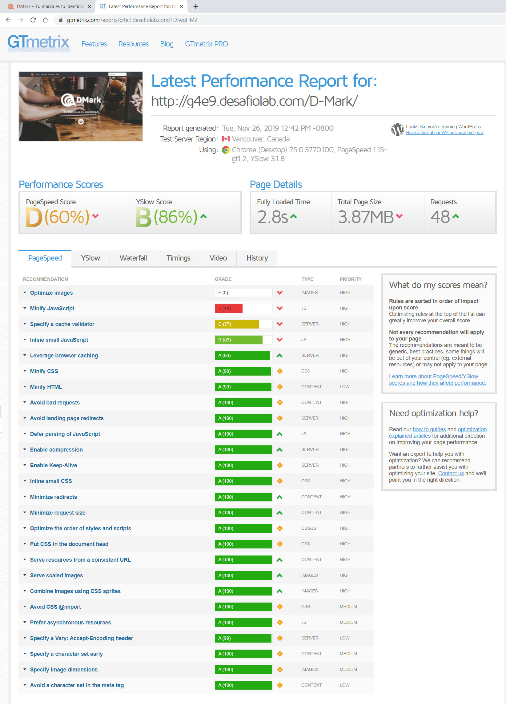
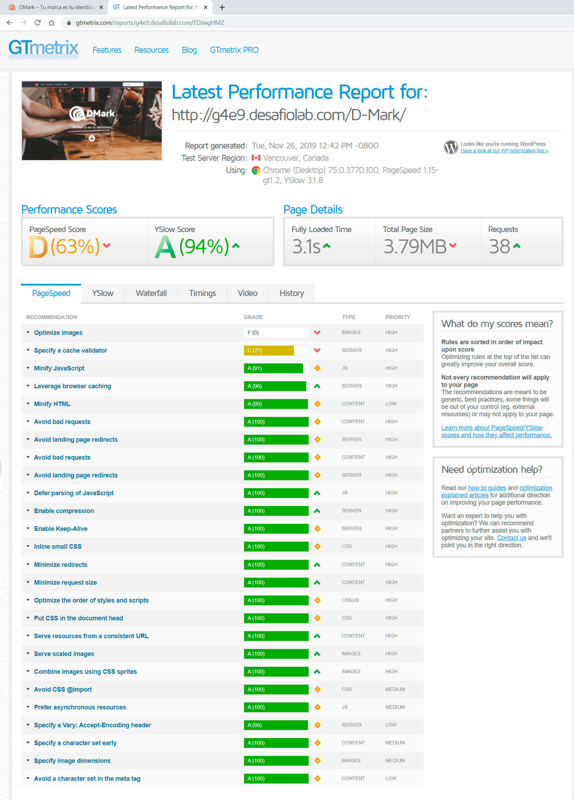
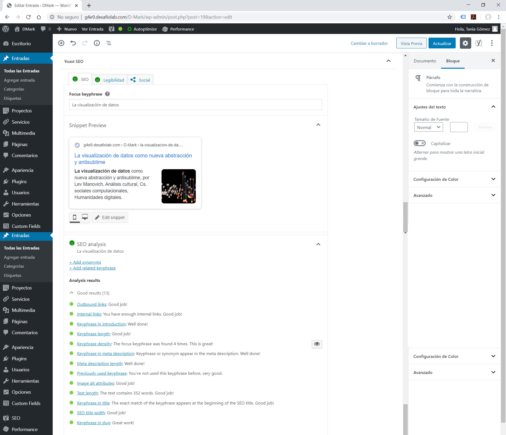
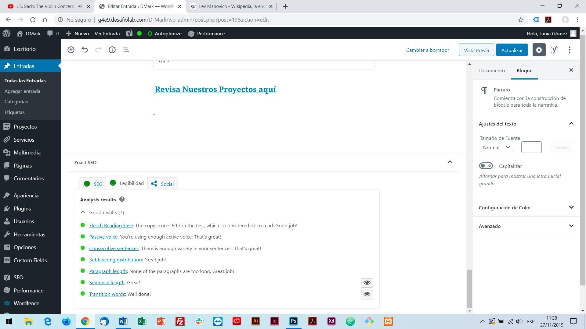
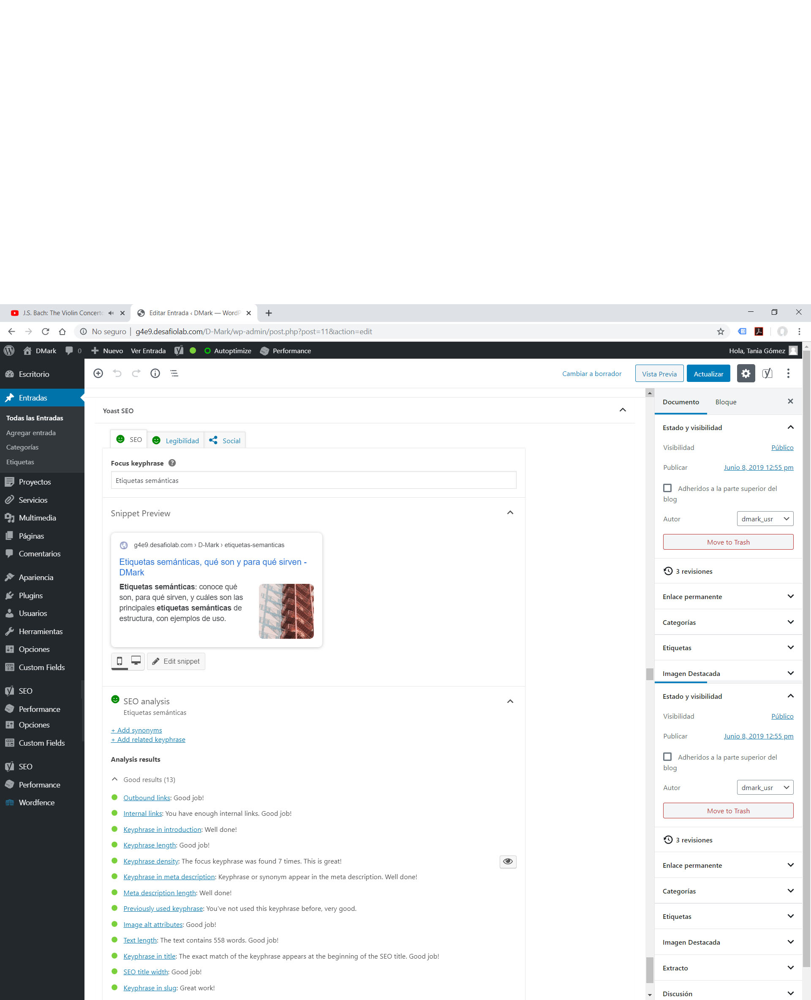
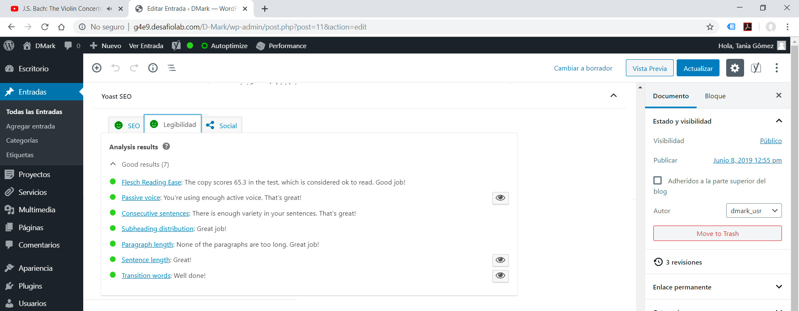
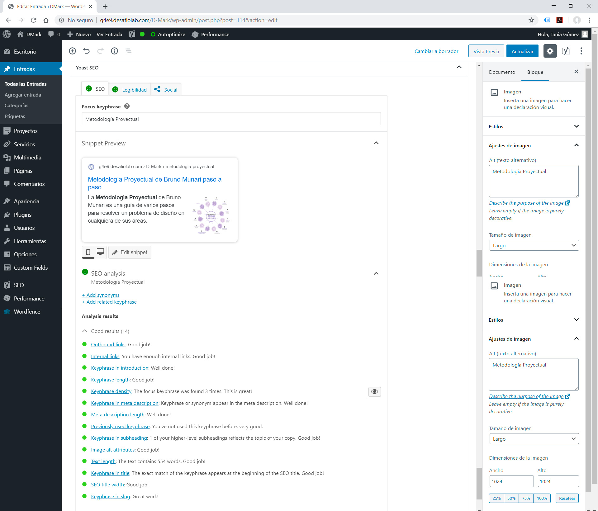
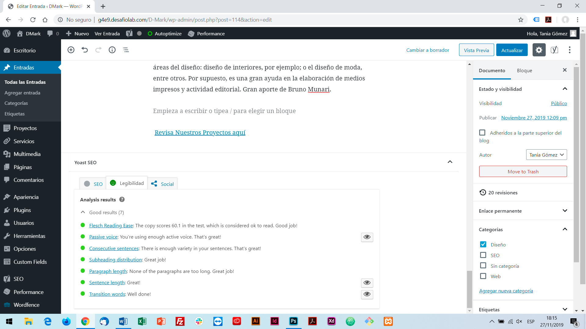
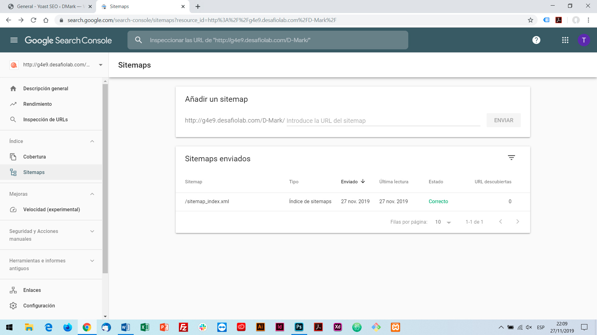

# Prueba - DMark, tu marca es tu identidad

### URL del sitio:
	[http://g4e9.desafiolab.com/D-Mark/](http://g4e9.desafiolab.com/D-Mark)

### Usuario y Contraseña del Sitio
	Usuario: tania-gomez
	Contraseña: TGA_user-dm333

### Aspectos de seguridad que optimicé:
	- Instalación de última versión de WordPress
	- Utilización de claves robustas
	- Reducción de permisos del archivo wp-config.php de 666 a 600
	- Instalación y configuración de plugin de seguridad Wordfence

### Optimización:
	- Archivo .htaccess con indicaciones para:
		Comprimir archivos de texto.
		Expiración de los headers, cada 1 mes.
		Desactivación ciertas etiquetas.
		Acceso denegado a archivos y directorios ocultos.
		Acceso denegado a los archivos de copia de seguridad y de origen.
		Permitir fuentes de dominio cruzado.
		Autocodificación en codificación UTF-8.
	- Instalación y configuración de plugin Smushit para optimización de imágenes.
	- Instalación y configuración de plugin Auotptimize para optimizar y minificar HTML, JavaScript y CSS.
	- Instalación y configuración de plugin W3 Total Cache para optimizar los temas de caché.

	
### Resultado anterior a la optimización:

### Resultado posterior a la optimización:

### Entrada 1: Análisis SEO

### Entrada 1: Análisis Legibilidad

### Entrada 2: Análisis SEO

### Entrada 2: Análisis Legibilidad

### Entrada 3: Análisis SEO

### Entrada 3: Análisis Legibilidad

### URL del Sitemap
[https://g4e9.desafiolab.com/D-Mark/sitemap.xml](https://g4e9.desafiolab.com/D-Mark/sitemap.xml)

### Integración con Google Search Console:

